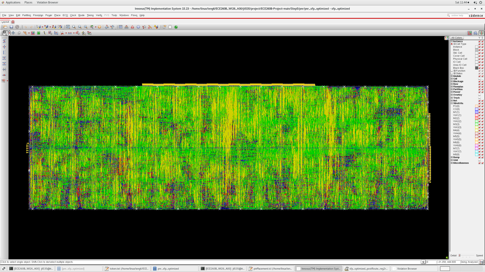
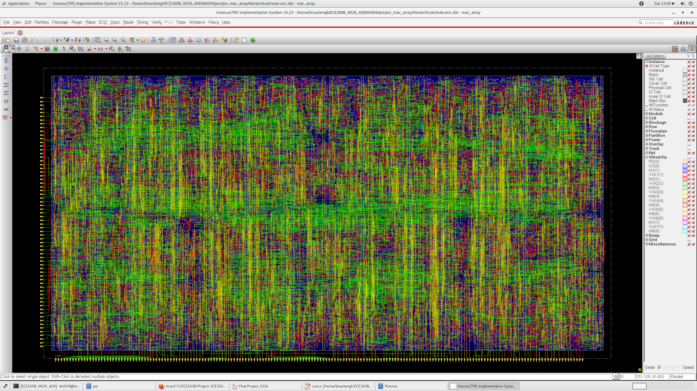
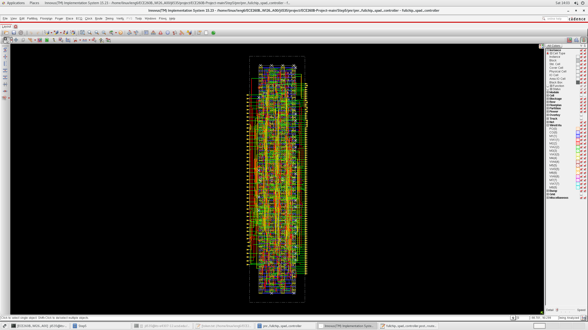
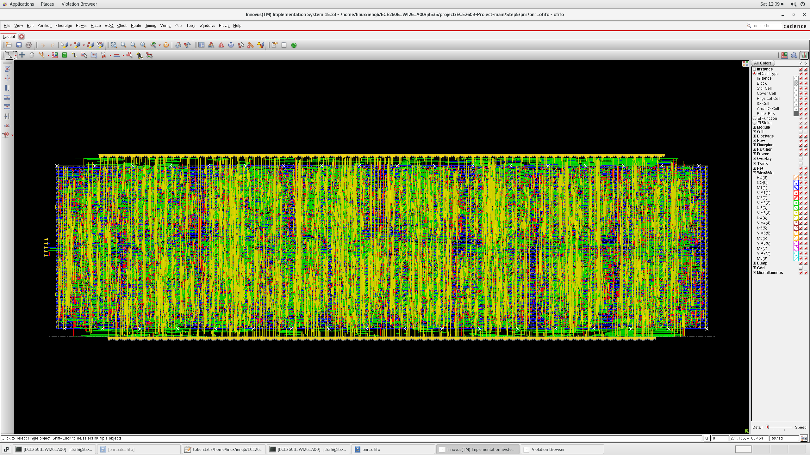
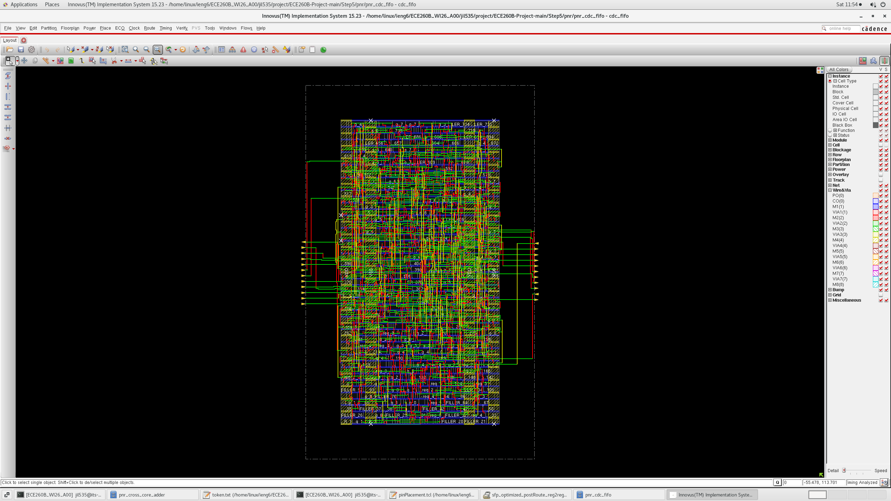
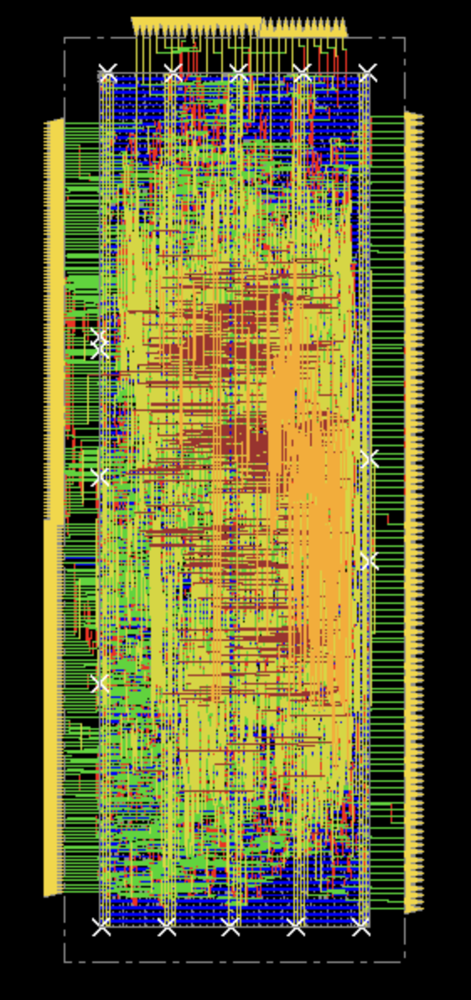
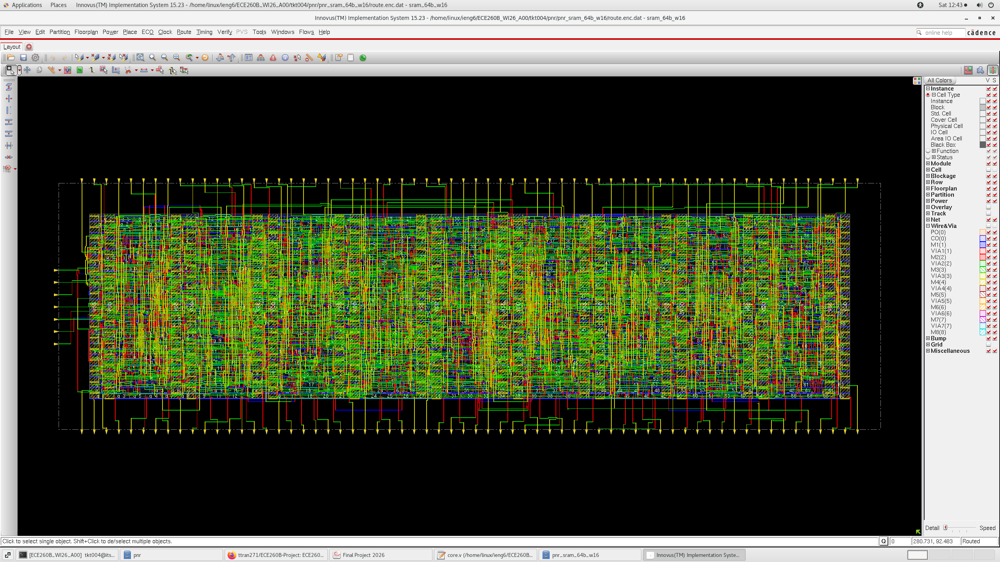
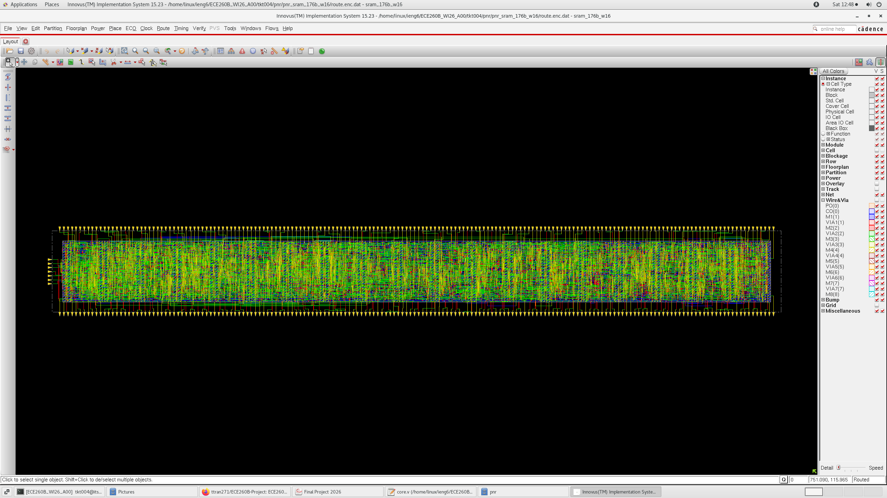
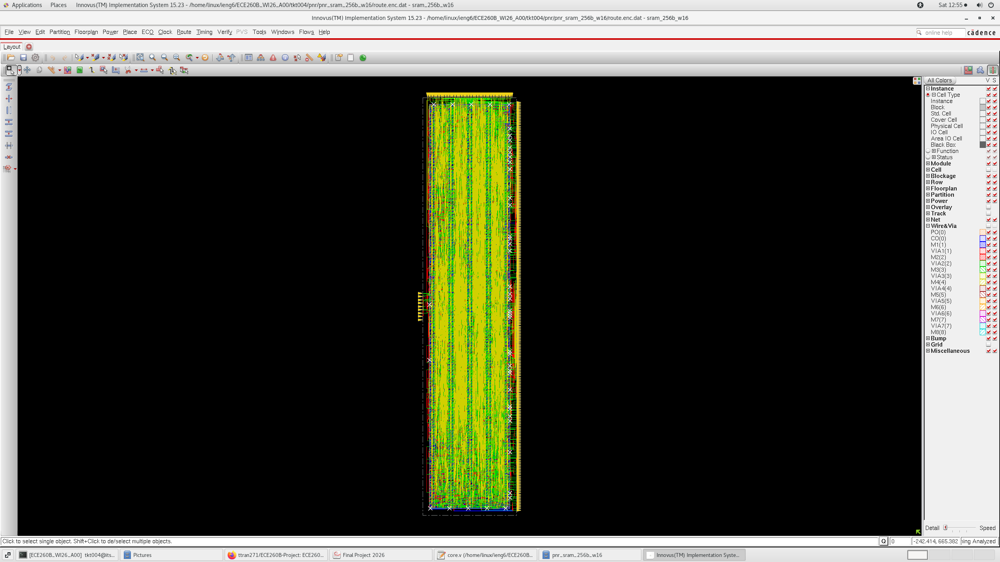

# Quad-Core Attention Accelerator

This repository is the public release snapshot for the final Step 6 version of a quad-core hardware attention accelerator RTL project. It collects the main Verilog sources, testbenches, dataset-generation scripts, representative simulation vectors, and curated synthesis / place-and-route collateral used to validate the design direction.

This release includes:

- timing-aware datapath cleanup for a 1 GHz target
- quad-core adaptive grouping and multicore integration
- double-buffered memory loading for better tile-to-tile overlap
- sparsity-aware B1 / B2 control paths and zero-skipping behavior
- standalone physical-design evidence for key submodules

Important notice: this repository is not open source. Redistribution, reuse, modification, and derivative works require prior written permission from the copyright owner. See [`LICENSE`](./LICENSE).

## What This Project Contains

At a high level, the design targets an attention-style accelerator pipeline with:

- a core compute fabric built from `mac_array`, `mac_col`, and `sfp_optimized`
- quad-core composition in [`verilog/core.v`](./verilog/core.v) and [`verilog/fullchip.v`](./verilog/fullchip.v)
- cross-core accumulation through [`verilog/cross_core_adder.v`](./verilog/cross_core_adder.v)
- SRAM-style local storage blocks and output FIFO / CDC support logic
- sparse test datasets for B1 and B2 filtering experiments
- synthesis and PnR snapshots for selected submodules

## Architecture Snapshot

### Main RTL blocks

- [`verilog/fullchip.v`](./verilog/fullchip.v): top-level quad-core integration
- [`verilog/fullchip_spad_controller.v`](./verilog/fullchip_spad_controller.v): scratchpad / top-level control integration
- [`verilog/core.v`](./verilog/core.v): per-core orchestration, memory control, and compute integration
- [`verilog/sfp_optimized.v`](./verilog/sfp_optimized.v): optimized sparse / filtering processing path with B2-related logic
- [`verilog/cross_core_adder.v`](./verilog/cross_core_adder.v): asynchronous standalone cross-core accumulation path
- [`verilog/mac_array.v`](./verilog/mac_array.v): MAC array datapath block
- [`verilog/mac_col.v`](./verilog/mac_col.v): column datapath and output alignment logic
- [`verilog/ofifo.v`](./verilog/ofifo.v), [`verilog/cdc_fifo.v`](./verilog/cdc_fifo.v), [`verilog/cdc_bus_1deep.v`](./verilog/cdc_bus_1deep.v): output / CDC support

### Final design highlights

- Includes the Step 5 timing and multicore optimizations in the final published RTL, including double buffering in `pmem`, `kmem`, and `qmem` for each core so loading the next tile can overlap with active computation.
- Added zero-skipping / gating so all-zero `Q` or `K` rows suppress unnecessary register and MAC switching.
- Added a minimal pipeline stage in `mac_col` to improve timing behavior near the 1 GHz target, accepting a +1 cycle output-path latency tradeoff.
- Extended the design to a quad-core adaptive grouping architecture with enabled-core grouping modes such as `[2,2]`, `[1,1,2]`, and full 4-core operation.
- Added input-duplication muxing so grouped cores can be loaded in parallel from the same input path.
- Applies the Step 6 skip-normalization flow and B2-related threshold / control behavior across `sfp_optimized`, `cross_core_adder`, `core`, and `fullchip`.

## Project Visuals

### RTL / block snapshots











### Physical-design snapshots









## Repository Layout

- [`verilog/`](./verilog): RTL sources and testbenches
- [`scripts/`](./scripts): Python dataset-generation utilities
- [`datafiles/`](./datafiles): simulation vectors, manifests, and sparse test cases
- [`sim/`](./sim): filelists and saved simulation outputs
- [`syn/`](./syn): release-packaged synthesis collateral for selected blocks
- [`pnr/`](./pnr): release-packaged place-and-route collateral for selected blocks
- [`images/`](./images): architecture and layout figures used in this README

## Datasets And Reproducibility

This release includes generated sample datasets for sparse execution experiments:

- [`datafiles/step6_sparse_sample/manifest.json`](./datafiles/step6_sparse_sample/manifest.json): sparse sample manifest
- [`datafiles/fullchip_b2_case/manifest.json`](./datafiles/fullchip_b2_case/manifest.json): full quad-core B2-oriented manifest

The included manifests show the default published configuration:

- the published sparse sample uses seed `2606`
- the published fullchip B2 case uses `2` tiles and `4` cores
- the sample dimensions are `8 x 8` with `pr=8` and `bw=8`
- published B1 keep ratio is about `0.299`
- published B2 keep ratio is about `0.625`

### Dataset generation scripts

- [`scripts/generate_sparse_dataset.py`](./scripts/generate_sparse_dataset.py): generates sparse attention-style vectors, thresholds, masks, normalized outputs, and result tensors
- [`scripts/generate_fullchip_b2_dataset.py`](./scripts/generate_fullchip_b2_dataset.py): prepares the fullchip B2-oriented dataset using the sparse generator

Example usage:

```bash
python scripts/generate_sparse_dataset.py --output-dir datafiles/step6_sparse_sample
python scripts/generate_fullchip_b2_dataset.py
```

Note: the scripts currently contain older path defaults referencing `Step6/...`. For this public release repo, you will likely want to normalize those defaults to repo-relative paths if you expect outside users to run them without modification.

## Simulation And Verification Assets

Representative testbenches included in [`verilog/`](./verilog):

- `sfp_optimized_tb.v`
- `sfp_b2_tb.v`
- `sfp_multicore_protocol_tb.v`
- `mac_array_tb.v`
- `mac_col_tb.v`
- `core_single_tb.v`
- `core_double_buffer_tb.v`
- `core_b2_cfg_tb.v`
- `fullchip_tb.v`
- `fullchip_b2_tb.v`
- `fullchip_spad_b2_cfg_tb.v`
- `cross_core_adder_tb.v`

Simulation filelists included:

- [`sim/filelist`](./sim/filelist)
- [`sim/single_core/filelist`](./sim/single_core/filelist)

Example simulation flow depends on your simulator, but the repo already gives the source ordering through the filelists.

## Release Packaging Notes

The repository has been cleaned for public release packaging:

- [`syn/`](./syn) keeps the useful synthesis deliverables and removes tool-cache artifacts
- [`pnr/`](./pnr) follows the lightweight release structure used by `pnr_sram_64b_w16`, keeping flow scripts, `constraints/`, and `netlist/`
- block-level helper notes are included in [`syn/README.md`](./syn/README.md) and [`pnr/README.md`](./pnr/README.md)

## Physical Design Status

The current release tells a clear story:

- standalone block-level physical-design results are strong enough to support the 1 GHz design direction
- the harder problem is hierarchical reintegration into `core` and full-chip top levels
- the final RTL in this repo is in place, but hierarchical top-level timing closure remains the main follow-on task

### Published evidence in the repo

- `sfp_optimized` hierarchical synthesis timing report shows paths meeting the target with worst reported slack at `0.000 ns` in the included report snapshot
- `sfp_optimized` flatten timing report shows a failing path at `-0.028 ns`, which is consistent with the remaining integration difficulty
- `sfp_optimized` hierarchical power report lists `370.6733 mW` dynamic power and `1.3667 mW` leakage in the included snapshot
- `mac_array` post-route summary reports:
  - standard-cell area: `229871.520 um^2`
  - core area: `234338.400 um^2`
  - total wire length: `575822.395 um`

### Current interpretation

The evidence in this repo supports the claim that submodules are in good shape, while core-level and full-chip hierarchical timing closure is still the limiting step. A reasonable next step is hierarchical PnR for the core while keeping only SRAM as a preserved hierarchical block.

## Quick Start

If you want to browse the release quickly:

1. Start with [`verilog/fullchip.v`](./verilog/fullchip.v), [`verilog/core.v`](./verilog/core.v), and [`verilog/sfp_optimized.v`](./verilog/sfp_optimized.v).
2. Review the sample manifests in [`datafiles/step6_sparse_sample/manifest.json`](./datafiles/step6_sparse_sample/manifest.json) and [`datafiles/fullchip_b2_case/manifest.json`](./datafiles/fullchip_b2_case/manifest.json).
3. Use [`sim/filelist`](./sim/filelist) with your preferred simulator to replay top-level verification.
4. Inspect [`syn/`](./syn) and [`pnr/`](./pnr) for the published implementation artifacts.

## Release Status

This repository should be treated as a public release snapshot of:

- RTL source for the quad-core accelerator and supporting blocks
- representative testbenches and sample vectors
- selected synthesis and physical-design collateral

This repository is not yet a fully turnkey reproduction kit. Some environment assumptions still reflect the original internal project structure and EDA flow.

## Ownership

- Code owner: `@JustinLinKK`
- GitHub CODEOWNERS file: [`.github/CODEOWNERS`](./.github/CODEOWNERS)

## Missing Information To Fill Before Final Public Polish

The repo is already strong on technical artifacts, but a few release-facing details are still missing or unclear from the files alone:

- Project abstract: a short 3-5 sentence summary of the problem, novelty, and headline result for non-specialist readers
- Target platform / process: exact process node, library, and intended implementation context you want to state publicly
- Toolchain requirements: simulator, synthesis tool, PnR tool, Python version, and required Python packages
- Reproduction steps: exact commands for running the main RTL simulations and regenerating the key figures / reports
- Evaluation summary: which metrics you want highlighted publicly such as frequency, area, power, latency, throughput, sparsity savings, or accuracy impact
- Figure captions: short human-readable captions for each image so outside readers know what each figure demonstrates
- Citation info: paper title, authors, affiliation, BibTeX, and contact email if you want this to be citable
- Version / release tag: a named release identifier such as `v1.0` or `artifact-eval-2026`
- Script path cleanup: the generator scripts still reference `Step6/...` in defaults, which should be updated if you want fully plug-and-play public reproduction

## License

This repository is distributed under a proprietary, all-rights-reserved license. No reuse, redistribution, modification, or derivative works are permitted without prior written permission. See [`LICENSE`](./LICENSE).
